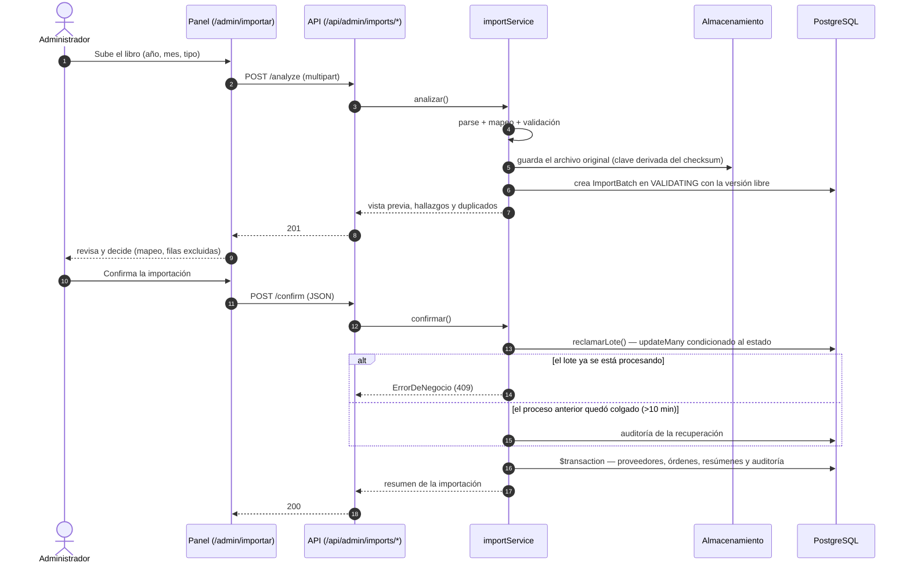
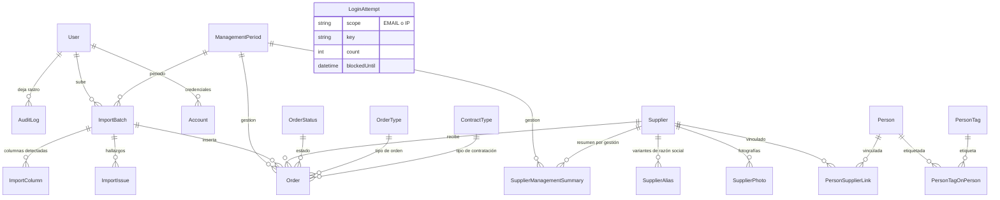

# Diagramas

Diagramas del sistema en Mermaid. Se ven directamente en GitHub y en cualquier editor
que lo soporte.

## Flujo del importador

Dos fases separadas a propósito: en el análisis **no se escribe ninguna orden**, y la
confirmación es una transición atómica seguida de una única transacción.

Puntos que el diagrama deja ver:

- El archivo original se guarda **antes** de cualquier decisión, y su clave se deriva del
  checksum, no del nombre que envía el navegador.
- La confirmación **no recibe filas**: relee el archivo del servidor. Si el navegador
  pudiera enviar las filas ya normalizadas, podría insertar registros que no existen.
- La transición a `PROCESSING` es atómica: si dos peticiones se cruzan, solo una pasa.

## Modelo de datos

Resumen de las relaciones principales (no exhaustivo: omite `Account`, `Session`,
`VerificationToken`, `ColumnVisibility` y `AppSetting`, que no tienen aristas).

Notas de lectura del modelo:

- `SupplierManagementSummary` es un **agregado materializado** por (proveedor, gestión):
  se rehace al importar y al eliminar, para que el portal no sume en cada visita.
- `Order.dedupeKey` (`orderNumber|ruc|amount|issueDate`) es lo que permite detectar una
  reimportación sin recorrer toda la tabla.
- `Order.amount` es *nullable* a propósito: un monto ilegible se guarda como texto en
  `rawAmount` y se marca con un `ImportIssue`, en vez de convertirse en 0.
- `Person.dni` es único y **nunca se publica**: la ficha pública muestra el nombre.
- `LoginAttempt` no tiene relaciones: es el limitador de intentos, indexado por
  (scope, key).
